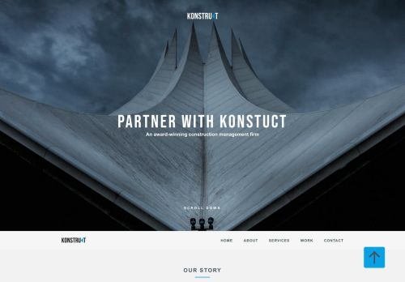

# Пример лэндинга Konstruct

# Оглавление
1. [Ссылка на макет](#ссылка-на-макет)
2. Инструменты и технологии применяемые в данном проекте

    2.1 [Редактор кода](#редактор-кода)
    
    2.2 [Технологии](#технологии)
    
    2.3 [Сборщик](#сборщик)
    
3. Тестирование 

    3.1 [Операционная система](#операционная-система)
    
    3.2 [CrossBrowser](#crossbrowser)

4. [Оптимизация](#оптимизация)
____
# Ссылка на макет 
> https://www.figma.com/file/zR1XfguUZ5wWWOy6ah30Xq/konstruct-template

:arrow_up: [Оглавление](#оглавление)
____
# Инструменты и технологии применяемые в данном проекте
____
## Редактор кода
Visual Studio Code (VSC)
## Технологии
- HTML
- CSS
  - SASS в формате SCSS
  - flexbox
  - Методология БЭМ
- PixelPerfect
 ## Сборщик
 Gulp
 
 :arrow_up: [Оглавление](#оглавление)
____
# Тестирование
## Операционная система
- Windows 10
- Windows 11
## CrossBrowser
- Chrome
- Opera
- Mozila Firefox
- Edge
- Yandex browser

:arrow_up: [Оглавление](#оглавление)
____
# Оптимизация
- Минификация файла style.css
- Минификация HTML файлов
- Минификация файлов изображений
- Использование sprite svg 
:arrow_up: [Оглавление](#оглавление)
____

